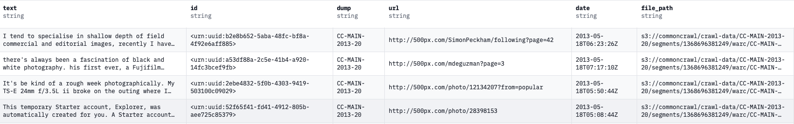

# Developing a nano GPT-2 from scratch using PyTorch and training using the Fineweb dataset


## Table of contents

- [About](#about);
- [Project Organization](#project-organization);
- [Train resources](#train-resources);
- [Usage for text generation](#usage-for-text-generation).

## About

Developing a custom nano GPT-2 from scratch using PyTorch an train in the EduFineWeb dataset. This repository was based on reproduce the [Open AI GPT-2 paper](https://d4mucfpksywv.cloudfront.net/better-language-models/language-models.pdf) and using the hyper-parameters for trianing from [Open AI GPT-3 paper](https://arxiv.org/abs/2005.14165). The dataset used was the [FineWeb 🍷](https://huggingface.co/datasets/HuggingFaceFW/fineweb) (the smalest version around 10B gpt2 number of tokens).

<p align="center">

<h6 align="center"> Example of the dataset used for the train and evaluation phase. For more details about the dataset you can visite the <a href="https://huggingface.co/datasets/HuggingFaceFW/fineweb">HuggingFace FineWEB</a>.</h6>

**Note**: This experiments was based on [Andrej Karpathy](https://karpathy.ai) works, called [nano GPT](https://github.com/karpathy/nanoGPT).

---

## Project Organization

```
├── LICENSE            <- Open-source license if one is chosen
├── Makefile           <- Makefile with convenience commands like `make data` or `make train`
├── README.md          <- The top-level README for developers using this project.
├── data
│   ├── external       <- Data from third party sources.
│   ├── interim        <- Intermediate data that has been transformed.
│   ├── processed      <- The final, canonical data sets for modeling.
│   └── raw            <- The original, immutable data dump.
│
├── docs               <- A default mkdocs project; see mkdocs.org for details
│
├── models             <- Trained and serialized models, model predictions, or model summaries
│
├── notebooks          <- Jupyter notebooks. Naming convention is a number (for ordering),
│                         
│                         `1.0-nbs-initial-data-exploration`.
│
├── pyproject.toml     <- Project configuration file with package metadata for custom_nanogpt2_fineweb
│                         and configuration for tools like black
│
├── references         <- Data dictionaries, manuals, and all other explanatory materials.
│
├── reports            <- Generated analysis as HTML, PDF, LaTeX, etc.
│   └── figures        <- Generated graphics and figures to be used in reporting
│
├── requirements.txt   <- The requirements file for reproducing the analysis environment, e.g.
│                         generated with `pip freeze > requirements.txt`
│
├── setup.cfg          <- Configuration file for flake8
│
└── src                <- Source code for use in this project.
    │
    ├── __init__.py    <- Makes src a Python module
    │
    ├── data           <- Scripts to manager the datta
    │   └── manager_data.py
    │
    ├── configs       <- Get configs for data, train and GPT model
    │   |── setup.py
    │   └── config.yaml
    │
    ├── model         <- Scripts to build the GPT-2 model
    │   |── transformer_blocks.py
    │   └── gpt2_model.py
    │
    ├── train.py  <- Scripts to train the GPT-2 model
    └── generate.py  <- Scripts to generate answers from the GPT-2 custom 
                        trained   model
```

--------


## Train Resources

The training process was conducted using a robust setup, featuring a system equipped with four NVIDIA GeForce RTX 3090 GPUs. The computational power was further supported by an Intel® Core™ i7-10700 CPU running at 2.90 GHz, complemented by a substantial 130 GB of RAM.

---

## Usage for text generation

Clone the repository and create a conda environment:

```
conda env create --name envname --file=environments.yml
```

Download the model file available in the link below and put in the follow path `models/` ([download this models checkpoint](https://drive.google.com/file/d/1YZwtNmsrfY1zjMr1_38kF0Lo9bDicA7O/view?usp=share_link)).


After that, open the file config_inf.yaml (`src/config/config_inference.yaml`) and choose the message you want (e.g `message: "Hello GPT, can you explain what is machine learning?"`)

And finally, for run the inference (don't need a GPU for run), just type this command:
```
python generate.py
```

The text generation will be stored in `reports/generation.json`:

```

```


